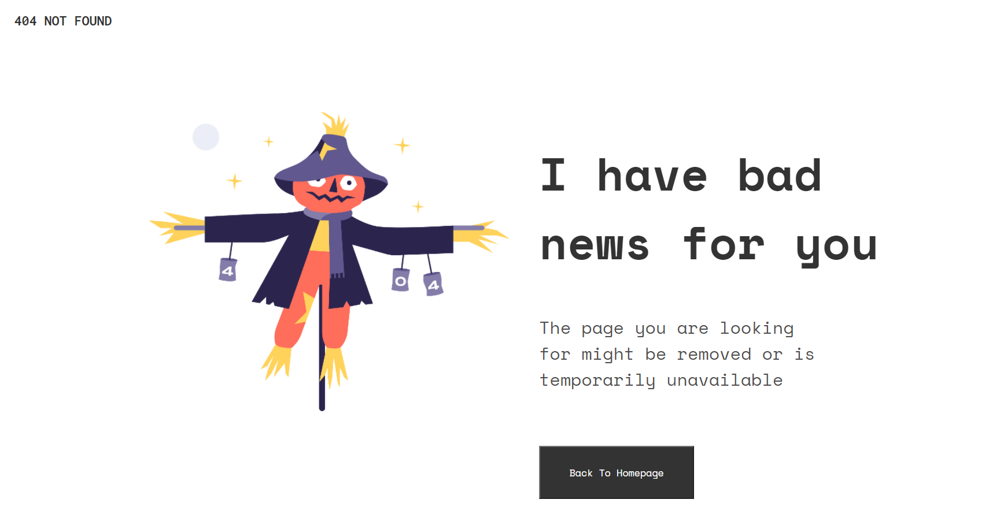

<!-- Please update value in the {}  -->

<h1 align="center">404 Not Found Page</h1>

   Solution for a challenge from  <a href="https://devchallenges.io/" target="_blank">Devchallenges.io</a>.

  <h3>
    <a href="https://k-ash-ish.github.io/404-Not-Found-devChallenges/">
      Demo
    </a>
     | 
    <a href="https://devchallenges.io/challenges/wBunSb7FPrIepJZAg0sY/edit?solutionId=s4d5qzVd3eVnuLZJaLNS">
      Solution
    </a>
     | 
    <a href="https://devchallenges.io/challenges/wBunSb7FPrIepJZAg0sY">
      Challenge
    </a>
  </h3>

<!-- TABLE OF CONTENTS -->

## Table of Contents

- [Overview](#overview)
  - [Built With](#built-with)
- [Features](#features)
- [Contact](#contact)
- [Acknowledgements](#acknowledgements)

<!-- OVERVIEW -->

## Overview

### Built With

<!-- This section should list any major frameworks that you built your project using. Here are a few examples.-->

- [HTML]
- [CSS]

## Features

<!-- List the features of your application or follow the template. Don't share the figma file here :) -->

This application/site was created as a submission to a [DevChallenges](https://devchallenges.io/challenges) challenge. The [challenge](https://devchallenges.io/challenges/wBunSb7FPrIepJZAg0sY) was to build an application to complete the given user stories.

## Acknowledgements

- [Marked - a markdown parser](https://github.com/chjj/marked)

## Contact

- Website -Work in Progress [your-website.com](https://{your-web-site-link})
- GitHub [@your-username](https://github.com/K-ash-ish})
- Twitter [@your-twitter](https://twitter.com/Kashish90879490)
